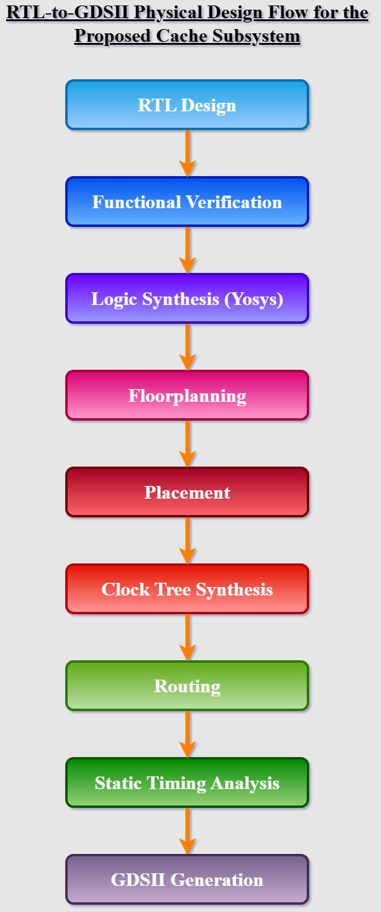
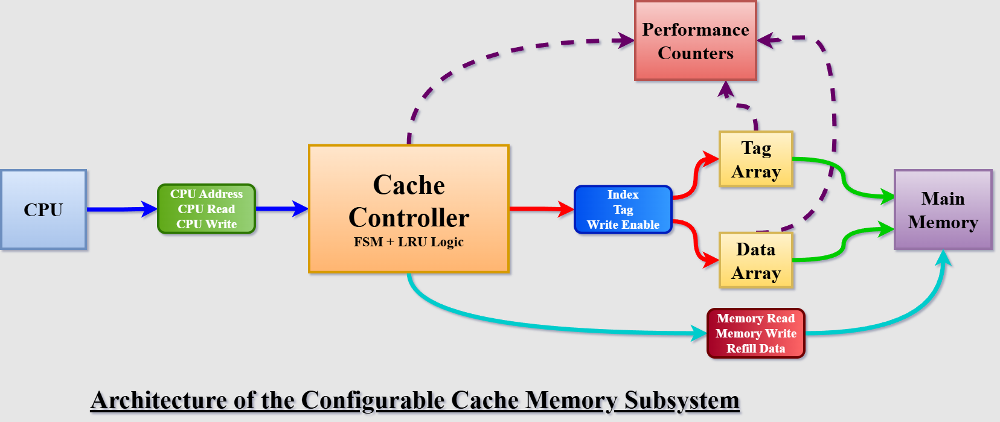

# Configurable Cache Memory Subsystem with RTL-to-GDSII Implementation


A parameterized cache memory subsystem designed in Verilog HDL and implemented through a complete ASIC design flow from RTL design to GDSII generation using Yosys and OpenROAD.


---


## Project Overview


This project implements a configurable cache memory subsystem supporting:


- Direct-Mapped Cache Architecture

- Write-Back Policy

- Dirty Bit Management

- 2-Way Set Associative Cache

- Least Recently Used (LRU) Replacement Policy

- Cache Performance Counters

- RTL-to-GDSII Physical Design Flow


The project demonstrates the complete ASIC implementation flow:

## RTL-to-GDSII Flow




---


# Cache Architecture

## Architecture




## Cache Specifications


| Parameter | Value |

|------------|--------|

| Address Width | 32-bit |

| Data Width | 32-bit |

| Line Size | 4 Words |

| Cache Organization | Direct-Mapped / 2-Way Set Associative |

| Write Policy | Write-Back |

| Replacement Policy | LRU |

| Technology Node | Nangate45 (45nm) |


---


# Features


✅ Direct-Mapped Cache Implementation


✅ Write-Back Support


✅ Dirty Bit Tracking


✅ Cache Refill Mechanism


✅ LRU-Based Replacement


✅ Performance Counters


✅ Parameterized Verilog Design


✅ Complete RTL-to-GDSII Flow


---


# Directory Structure


```text

Cache\_Subsystem

│

├── rtl/

├── tb/

├── synthesis/

├── physical\_design/

├── docs/

├── report/

└── README.md

```


---


# RTL Modules


| Module | Description |

|---------|-------------|

| cache\_top.v | Top-level cache module |

| cache\_controller.v | Cache control FSM |

| data\_array.v | Cache data memory |

| tag\_array.v | Tag memory and valid bits |

| lru\_logic.v | LRU replacement logic |

| performance\_counters.v | Cache statistics |

| main\_memory.v | Behavioral main memory |


---


# Testbenches


| Testbench | Description |

|------------|-------------|

| tb\_cache\_top.v | Top-level verification |

| tb\_data\_array.v | Data array verification |

| tb\_tag\_array.v | Tag array verification |

| tb\_main\_memory.v | Main memory verification |


---


# Functional Verification Results


## Cache Read Miss and Refill


---


## Cache Read Hit


---


## Write Hit and Dirty Bit Update


---


## LRU-Based Cache Replacement


---


## Cache Performance Counters


---


# Synthesis Results


## RTL Viewer


---


## Technology Mapping


---


## Yosys Synthesis Statistics


---


# Physical Design Flow


The design was synthesized and implemented using:


- Yosys

- OpenROAD

- Nangate45 Standard Cell Library


---


# Floorplan and Power Distribution Network


---


# Placement View


---


# Routed Layout


---


# Final Routed Layout


---


# Physical Design Results


---


# Final ASIC Implementation Metrics


| Parameter | Result |

|------------|---------|

| Technology Node | Nangate45 (45 nm) |

| Final Design Area | 101,684 µm² |

| Core Utilization | 18% |

| Standard Cell Count | 189,626 |

| WNS (Worst Negative Slack) | 0.00 ns |

| TNS (Total Negative Slack) | 0.00 ns |

| Timing Closure | Achieved |

| Physical Design Flow | RTL → Synthesis → Floorplanning → Placement → CTS → Routing → GDSII |


---


# Generated Physical Design Files


| File | Description |

|------|-------------|

| 6\_final.def | Final DEF layout |

| 6\_final.gds | GDSII layout |

| 6\_final.spef | Parasitic extraction |

| 6\_final.v | Post-layout netlist |


---


# Tools Used


- Verilog HDL

- ModelSim

- Quartus Prime

- Yosys

- OpenROAD

- Nangate45 Library

- GTKWave


---


# Future Improvements


- Multi-Level Cache Hierarchy

- Cache Coherency Protocols

- ECC Support

- Non-Blocking Cache

- AXI/AHB Interface Integration

- Cache Prefetching Mechanisms


---


# Author


Soumyadeep Dutta


B.Tech – VLSI Design  

Vellore Institute of Technology, Chennai

GitHub: https://github.com/soumyadeepdutta0205-sudo

---


# License


This project is released under the MIT License.

